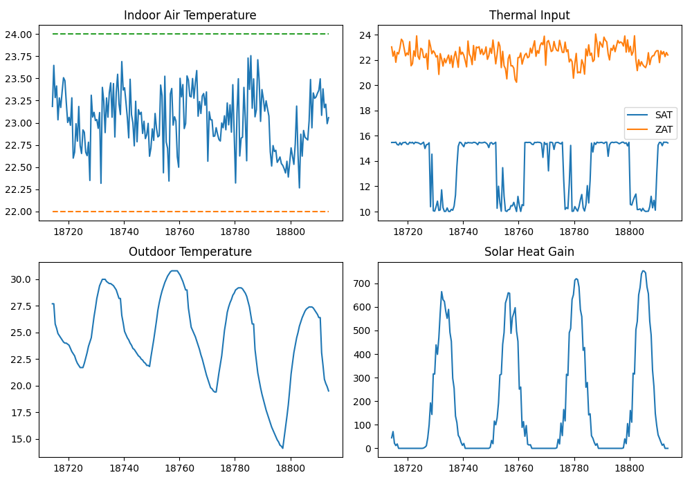
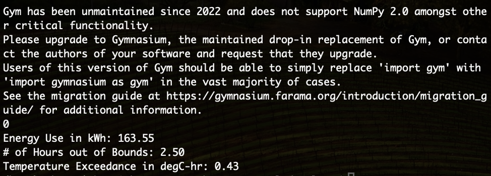

# Meta-RL for HVAC Control

This project studies meta-reinforcement learning (Meta-RL) for HVAC control.

The goal is to learn a policy that can generalize across different environments (with different 3R2C parameters), and then adapt quickly to a new environment.

---

## Pipeline

The workflow includes three main steps:

1. Meta-RL training using PPO  
2. Inner-loop adaptation using DDPG  
3. Policy evaluation and visualization  

---

## Meta-RL Training

We train a shared policy across multiple environments.

- Each environment has different 3R2C parameters  
- The policy outputs SAT (supply air temperature) and ZAT (zone setpoint)  
- PPO is used for meta-training  

However, the new environment is more complex, so training is not very stable.

- Initial return is around -4.3  
- After scaling, it fluctuates around -0.9 to -2.0  
- We save the **best model** instead of the last one  

---

## Adaptation (DDPG)

We use DDPG to adapt the meta-policy to a specific environment.

- Initialize DDPG actor with PPO policy  
- Fine-tune on a fixed environment  

Observations:

- Sometimes DDPG does not converge in one run  
- Running multiple times usually gives a good result  
- Compared to training from scratch, success rate is much higher  
- Pure DDPG (random init) almost always fails  

---

## Evaluation Results

### Policy Evaluation

<p align="center">
  
  
</p>

From the results:

- Temperature is well controlled  
- System stays close to the desired range  
- Control signals are somewhat noisy  
- Overall behavior is reasonable  

---

## How to Run

### Meta-RL Training

```bash
python meta-rl.py
````

---

### Adaptation

```bash
python ddpg_update.py
```

---

### Evaluation

```bash
python offline_test.py
```

This will generate plots and CSV results.

---

## Files

* `meta-rl.py` — PPO meta training
* `ddpg_update.py` — DDPG adaptation
* `offline_test.py` — evaluation and plotting
* `Env_develop.py` — environment

---

## Future Work

* Improve reward design
* Better normalization
* Improve meta-policy quality
* Reduce oscillation in control

---

## Repository

https://github.com/zyz990808/meta-rl_HVAC_PyTorch/tree/update_2

