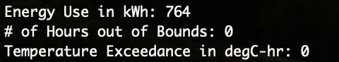
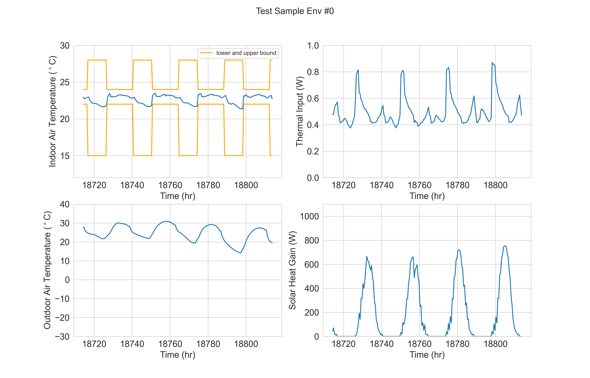

# Meta-RL for HVAC Control

This project implements a meta-reinforcement learning (Meta-RL) framework for HVAC control. The goal is to learn a general control policy that can quickly adapt to new environments while maintaining thermal comfort and reducing energy consumption.

---

## Overview

The framework consists of two stages:

1. **Outer loop (Meta-training with PPO)**
2. **Inner loop (Adaptation with DDPG)**

The workflow is:
- Train a meta-policy on multiple environments
- Adapt the policy to a new environment
- Evaluate performance on the target environment

---

## 1. Meta-Training (Outer Loop)

We use PPO to train a meta-policy across different environments.

Run:
```bash
python3 ppo_multi_env_train.py

The trained meta-policy will be saved in:

/model/multi_env/

---

## 2. Adaptation (Inner Loop)

We use DDPG to adapt the meta-policy to a new environment.

Run:

python3 ddpg_update.py

The adapted policy will be saved in:

/model/online/

---

## 3. Evaluation

We evaluate the adapted policy on the target environment.

Run:

python3 offline_test.py

This will:

Compute energy consumption

Compute comfort violations

Generate plots

Results will be saved in:

/plots/offline/

---

## Example Result

Below is a sample result:

- Energy Use: **764 kWh**
- Hours Out of Bounds: **0**
- Temperature Exceedance: **0 degC-hr**

The indoor temperature stays within the comfort range and remains stable.

### Numerical Results


### Control Performance


---

# Key Features

Meta-RL framework for HVAC control

Fast adaptation to new environments

Stable temperature regulation

Zero comfort violation in test case

Training completes within ~30 minutes

---

# Project Structure
model/
  ├── multi_env/    # meta-policy
  ├── online/       # adapted policy

plots/
  └── offline/      # evaluation plots

scripts/
  ├── ppo_multi_env_train.py
  ├── ddpg_update.py
  └── offline_test.py

  ---